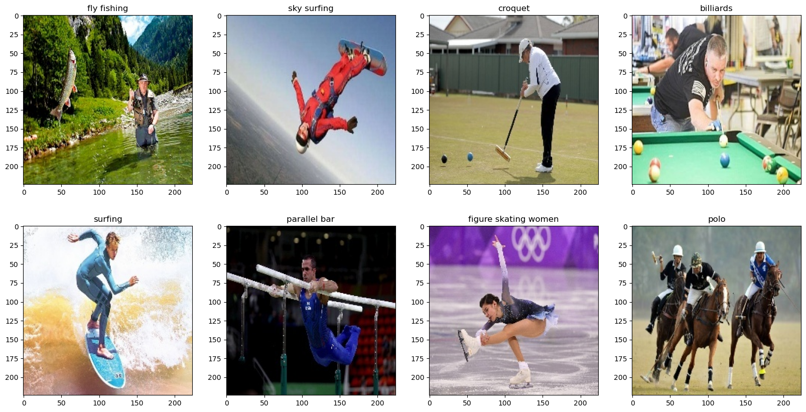
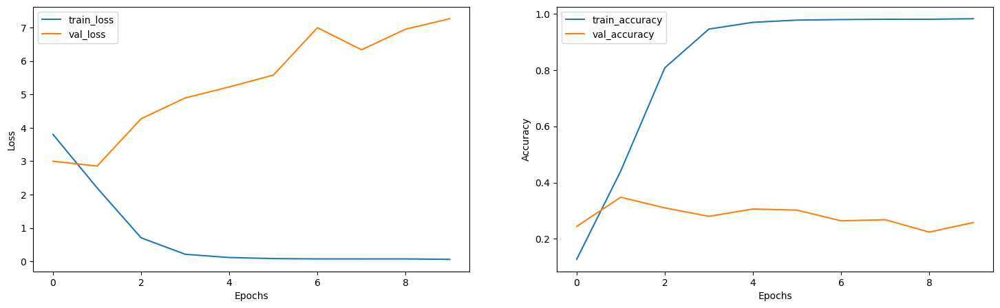
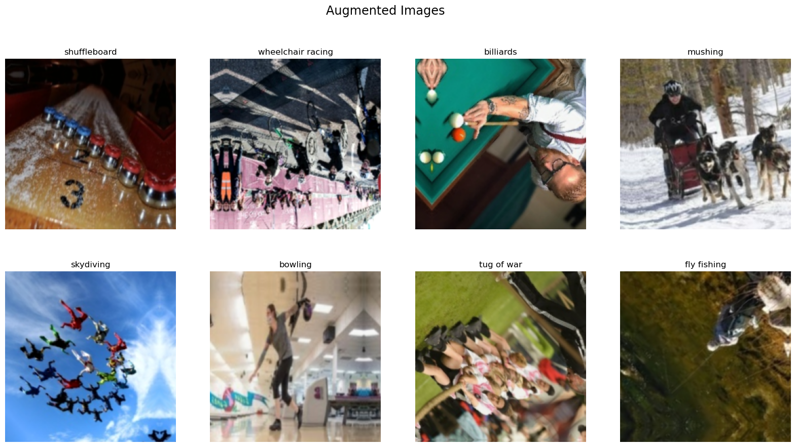
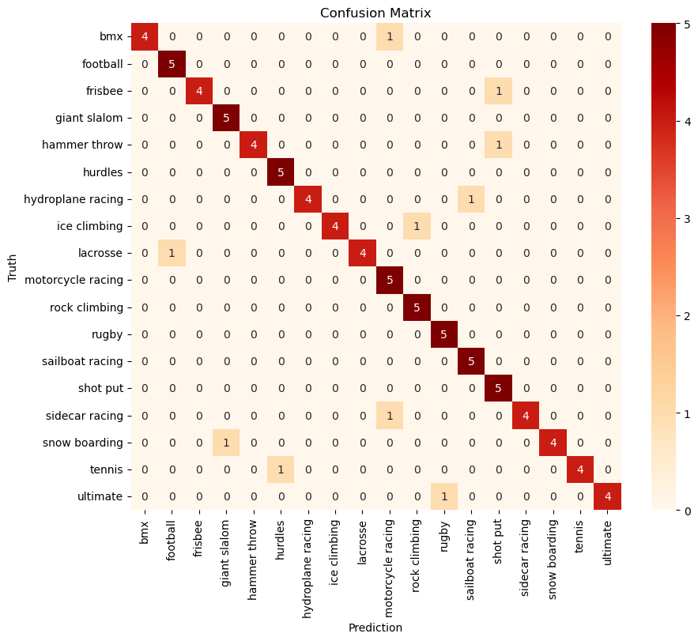

```python
# This Python 3 environment comes with many helpful analytics libraries installed
# It is defined by the kaggle/python Docker image: https://github.com/kaggle/docker-python
# For example, here's several helpful packages to load

import numpy as np # linear algebra
import pandas as pd # data processing, CSV file I/O (e.g. pd.read_csv)

# Input data files are available in the read-only "../input/" directory
# For example, running this (by clicking run or pressing Shift+Enter) will list all files under the input directory

import os
for dirname, _, filenames in os.walk('/kaggle/input'):
    for filename in filenames:
        #print(os.path.join(dirname, filename))
        break

# You can write up to 20GB to the current directory (/kaggle/working/) that gets preserved as output when you create a version using "Save & Run All" 
# You can also write temporary files to /kaggle/temp/, but they won't be saved outside of the current session
```

# INITIAL IMPORTS AND SETTING UP THE ENVIRONMENT


```python
# Importing necessary libraries
import glob
import math
import random
import cv2 as cv
import tensorflow as tf
from matplotlib import pyplot as plt
```

    /opt/conda/lib/python3.10/site-packages/tensorflow_io/python/ops/__init__.py:98: UserWarning: unable to load libtensorflow_io_plugins.so: unable to open file: libtensorflow_io_plugins.so, from paths: ['/opt/conda/lib/python3.10/site-packages/tensorflow_io/python/ops/libtensorflow_io_plugins.so']
    caused by: ['/opt/conda/lib/python3.10/site-packages/tensorflow_io/python/ops/libtensorflow_io_plugins.so: undefined symbol: _ZN3tsl6StatusC1EN10tensorflow5error4CodeESt17basic_string_viewIcSt11char_traitsIcEENS_14SourceLocationE']
      warnings.warn(f"unable to load libtensorflow_io_plugins.so: {e}")
    /opt/conda/lib/python3.10/site-packages/tensorflow_io/python/ops/__init__.py:104: UserWarning: file system plugins are not loaded: unable to open file: libtensorflow_io.so, from paths: ['/opt/conda/lib/python3.10/site-packages/tensorflow_io/python/ops/libtensorflow_io.so']
    caused by: ['/opt/conda/lib/python3.10/site-packages/tensorflow_io/python/ops/libtensorflow_io.so: undefined symbol: _ZTVN10tensorflow13GcsFileSystemE']
      warnings.warn(f"file system plugins are not loaded: {e}")
    


```python
train_folder = '/kaggle/input/sports-classification/train'
test_folder = '/kaggle/input/sports-classification/test'
validation_folder = '/kaggle/input/sports-classification/valid'
```


```python
# Function to convert images from bgr to rgb channels

def get_rgb_image(image):
    rgb_image = cv.cvtColor(image, cv.COLOR_BGR2RGB)
    return rgb_image
```

# VISUALIZING THE DATA


```python
# Getting few random images from training data

def get_random_images(folder, n_images=8):
    c = 4
    r = math.ceil(n_images/c)
    
    plt.figure(figsize=(20,10))
    for i in range(n_images):
        plt.subplot(r,c,i+1)
        rand_image = random.choice(glob.glob(f'{folder}/*/*'))
        image = cv.imread(rand_image)
        plt.imshow(get_rgb_image(image))
        plt.title(rand_image.split('/')[-2]);

get_random_images(train_folder)
```


    

    


# CREATING DATA PIPELINE AND PREPROCESSING


```python
# Using keras to load the data into pipeline 

train_data = tf.keras.utils.image_dataset_from_directory(train_folder)
#train_data = data.prefetch(tf.data.AUTOTUNE).cache()
validation_data = tf.keras.utils.image_dataset_from_directory(validation_folder) #.prefetch(tf.data.AUTOTUNE).cache()
class_names = train_data.class_names
batch = train_data.as_numpy_iterator().next()
batch[0].shape
```

    Found 13492 files belonging to 100 classes.
    Found 500 files belonging to 100 classes.
    


    (32, 256, 256, 3)


```python
# Let us get the class_names list which is arranged in accordance with the ascending order of label values. This means the index of class_names is the label assigned.

class_names[:5]
```


    ['air hockey', 'ampute football', 'archery', 'arm wrestling', 'axe throwing']


```python
# Let us scale the data between 0 and 1. Since the rbg values are between 1 to 255 dividing by 255.

scaled_data = train_data.map(lambda x,y:(x/255,y)) 
scaled_val_data = validation_data.map(lambda x,y: (x/255, y))
```

# CREATING A DEEP NEURAL NETWORK MODEL


```python
# Importing necessary functions and class for implementing CNN

from tensorflow.keras import layers
from tensorflow.keras.models import Sequential
from tensorflow.keras.layers import Conv2D, MaxPooling2D, Dense, Flatten, Dropout
from tensorflow.keras.metrics import Precision, Recall, BinaryAccuracy
from tensorflow.keras.models import load_model
```


```python
model = Sequential()

model.add(Conv2D(filters=32, kernel_size = 3, strides=1, activation='relu', input_shape=(256,256,3)))
model.add(MaxPooling2D())

model.add(Conv2D(filters=64, kernel_size = 3, strides=1, activation='relu'))
model.add(MaxPooling2D())

model.add(Conv2D(filters=32, kernel_size = 3, strides=1, activation='relu'))
model.add(MaxPooling2D())

model.add(Flatten())

model.add(Dense(1000, activation='relu'))
model.add(Dense(100, activation='softmax'))

model.compile('adam', loss='sparse_categorical_crossentropy', metrics=['accuracy'])

model.summary()
```

    Model: "sequential"
    _________________________________________________________________
     Layer (type)                Output Shape              Param #   
    =================================================================
     conv2d (Conv2D)             (None, 254, 254, 32)      896       
                                                                     
     max_pooling2d (MaxPooling2D  (None, 127, 127, 32)     0         
     )                                                               
                                                                     
     conv2d_1 (Conv2D)           (None, 125, 125, 64)      18496     
                                                                     
     max_pooling2d_1 (MaxPooling  (None, 62, 62, 64)       0         
     2D)                                                             
                                                                     
     conv2d_2 (Conv2D)           (None, 60, 60, 32)        18464     
                                                                     
     max_pooling2d_2 (MaxPooling  (None, 30, 30, 32)       0         
     2D)                                                             
                                                                     
     flatten (Flatten)           (None, 28800)             0         
                                                                     
     dense (Dense)               (None, 1000)              28801000  
                                                                     
     dense_1 (Dense)             (None, 100)               100100    
                                                                     
    =================================================================
    Total params: 28,938,956
    Trainable params: 28,938,956
    Non-trainable params: 0
    _________________________________________________________________
    


```python
import os
logdir='logs'
if not os.path.exists(logdir):
    os.mkdir(logdir)
tensor_logs = tf.keras.callbacks.TensorBoard(log_dir = logdir)
history = model.fit(scaled_data, epochs=10, validation_data=scaled_val_data, callbacks=[tensor_logs])
```

    Epoch 1/10
    422/422 [==============================] - 62s 124ms/step - loss: 3.8009 - accuracy: 0.1271 - val_loss: 2.9982 - val_accuracy: 0.2440
    Epoch 2/10
    422/422 [==============================] - 29s 69ms/step - loss: 2.2019 - accuracy: 0.4410 - val_loss: 2.8532 - val_accuracy: 0.3480
    Epoch 3/10
    422/422 [==============================] - 28s 66ms/step - loss: 0.7055 - accuracy: 0.8080 - val_loss: 4.2704 - val_accuracy: 0.3100
    Epoch 4/10
    422/422 [==============================] - 30s 71ms/step - loss: 0.2133 - accuracy: 0.9456 - val_loss: 4.8925 - val_accuracy: 0.2800
    Epoch 5/10
    422/422 [==============================] - 34s 81ms/step - loss: 0.1157 - accuracy: 0.9696 - val_loss: 5.2237 - val_accuracy: 0.3060
    Epoch 6/10
    422/422 [==============================] - 30s 69ms/step - loss: 0.0847 - accuracy: 0.9775 - val_loss: 5.5760 - val_accuracy: 0.3020
    Epoch 7/10
    422/422 [==============================] - 28s 66ms/step - loss: 0.0750 - accuracy: 0.9795 - val_loss: 6.9935 - val_accuracy: 0.2640
    Epoch 8/10
    422/422 [==============================] - 27s 63ms/step - loss: 0.0744 - accuracy: 0.9807 - val_loss: 6.3342 - val_accuracy: 0.2680
    Epoch 9/10
    422/422 [==============================] - 27s 61ms/step - loss: 0.0749 - accuracy: 0.9805 - val_loss: 6.9503 - val_accuracy: 0.2240
    Epoch 10/10
    422/422 [==============================] - 27s 62ms/step - loss: 0.0616 - accuracy: 0.9824 - val_loss: 7.2632 - val_accuracy: 0.2580
    


```python
def plot_history_tf(model_history):

    plt.figure(figsize=(18,5))
    plt.subplot(1,2,1)
    plt.plot(model_history.history['loss'])
    plt.plot(model_history.history['val_loss'])
    plt.xlabel('Epochs')
    plt.ylabel('Loss')
    plt.legend(['train_loss', 'val_loss'])

    plt.subplot(1,2,2)
    plt.plot(model_history.history['accuracy'])
    plt.plot(model_history.history['val_accuracy'])
    plt.xlabel('Epochs')
    plt.ylabel('Accuracy')
    plt.legend(['train_accuracy', 'val_accuracy'])

    plt.show()
    
plot_history_tf(history)
```


    

    


#### We can observe from the plots that loss in validation set is increasing and accuracy is decreasing whereas in case of training data it is vice versa. 
#### This means that there is significant amount of overfitting done by the model. Hence, let us try to add some noise by augmenting the data.


```python
img_augmentation = Sequential(
    [
        layers.RandomRotation(factor=0.15),
        layers.RandomTranslation(height_factor=0.1, width_factor=0.1),
        layers.RandomFlip(),
        layers.RandomContrast(factor=0.1),
    ],
    name="img_augmentation",
)

plt.figure(figsize=(20,10))
plt.suptitle('Augmented Images', fontsize='xx-large')
for (i, img), label in zip(enumerate(batch[0]), batch[1]):
    result = img
    plt.subplot(2,4,i+1)
    plt.imshow(img_augmentation(img).numpy().astype(int))
    plt.title(class_names[label])
    plt.axis('off')
    if i == 7:
        break
```


    

    


```python
model2 = Sequential(
    [
        layers.RandomRotation(factor=0.15),
        layers.RandomTranslation(height_factor=0.1, width_factor=0.1),
        layers.RandomFlip(),
        layers.RandomContrast(factor=0.1),
    ],
    name="img_augmentation",
)

model2.add(Conv2D(filters=32, kernel_size = 3, strides=1, activation='relu', input_shape=(256,256,3)))
model2.add(MaxPooling2D())

model2.add(Conv2D(filters=64, kernel_size = 3, strides=1, activation='relu'))
model2.add(MaxPooling2D())

model2.add(Conv2D(filters=32, kernel_size = 3, strides=1, activation='relu'))
model2.add(MaxPooling2D())

model2.add(Flatten())

model2.add(Dense(1000, activation='relu'))
model2.add(Dense(100, activation='softmax'))

model2.compile('adam', loss='sparse_categorical_crossentropy', metrics=['accuracy'])

hist = model2.fit(scaled_data, epochs=10, validation_data=scaled_val_data, callbacks=[tensor_logs])
```

    Epoch 1/10
    422/422 [==============================] - 29s 62ms/step - loss: 4.4211 - accuracy: 0.0367 - val_loss: 4.1038 - val_accuracy: 0.0580
    Epoch 2/10
    422/422 [==============================] - 29s 66ms/step - loss: 3.9102 - accuracy: 0.0925 - val_loss: 3.5490 - val_accuracy: 0.1560
    Epoch 3/10
    422/422 [==============================] - 30s 70ms/step - loss: 3.4862 - accuracy: 0.1556 - val_loss: 3.1820 - val_accuracy: 0.2320
    Epoch 4/10
    422/422 [==============================] - 29s 67ms/step - loss: 3.1867 - accuracy: 0.2096 - val_loss: 2.9761 - val_accuracy: 0.2720
    Epoch 5/10
    422/422 [==============================] - 29s 69ms/step - loss: 2.9907 - accuracy: 0.2444 - val_loss: 2.9811 - val_accuracy: 0.2620
    Epoch 6/10
    422/422 [==============================] - 29s 66ms/step - loss: 2.8568 - accuracy: 0.2794 - val_loss: 2.7571 - val_accuracy: 0.3120
    Epoch 7/10
    422/422 [==============================] - 28s 64ms/step - loss: 2.7630 - accuracy: 0.2982 - val_loss: 2.6858 - val_accuracy: 0.3520
    Epoch 8/10
    422/422 [==============================] - 30s 69ms/step - loss: 2.6592 - accuracy: 0.3191 - val_loss: 2.6714 - val_accuracy: 0.3560
    Epoch 9/10
    422/422 [==============================] - 29s 68ms/step - loss: 2.5863 - accuracy: 0.3355 - val_loss: 2.4494 - val_accuracy: 0.3840
    Epoch 10/10
    422/422 [==============================] - 28s 65ms/step - loss: 2.4974 - accuracy: 0.3536 - val_loss: 2.5767 - val_accuracy: 0.3540
    

#### It seems that problem related to overfitting is solved but the training is very slow. I tried training it by increasing the learning rate but it performs worse than the present model. 
#### Also, I tried to train the model for 30, 50 and 100 epochs but the validation accuracy reaches to upto maximum of 56% and then starts to overfit again resulting in reduction of validation accuracy. 
#### Hence let us try transfer learning and use pre trained models, such as EfficientNetB0 and MobileNet for our models.

# TRANSFER LEARNING


```python
# Let us try first using Mobile Net from tensorflow applications

preprocess_input = tf.keras.applications.mobilenet_v2.preprocess_input

base_model = tf.keras.applications.MobileNetV2(input_shape=(256,256,3),
                                               include_top=False,
                                               weights='imagenet')
```

    Downloading data from https://storage.googleapis.com/tensorflow/keras-applications/mobilenet_v2/mobilenet_v2_weights_tf_dim_ordering_tf_kernels_1.0_224_no_top.h5
    9406464/9406464 [==============================] - 0s 0us/step
    


```python
image_batch, label_batch = next(iter(train_data))
feature_batch = base_model(image_batch)
base_model.trainable=False
base_model.summary()
```

    Model: "mobilenetv2_1.00_224"
    __________________________________________________________________________________________________
     Layer (type)                   Output Shape         Param #     Connected to                     
    ==================================================================================================
     input_1 (InputLayer)           [(None, 256, 256, 3  0           []                               
                                    )]                                                                
                                                                                                      
     Conv1 (Conv2D)                 (None, 128, 128, 32  864         ['input_1[0][0]']                
                                    )                                                                 
                                                                                                      
     bn_Conv1 (BatchNormalization)  (None, 128, 128, 32  128         ['Conv1[0][0]']                  
                                    )                                                                 
                                                                                                      
     Conv1_relu (ReLU)              (None, 128, 128, 32  0           ['bn_Conv1[0][0]']               
                                    )                                                                 
                                                                                                      
     expanded_conv_depthwise (Depth  (None, 128, 128, 32  288        ['Conv1_relu[0][0]']             
     wiseConv2D)                    )                                                                 
                                                                                                      
     expanded_conv_depthwise_BN (Ba  (None, 128, 128, 32  128        ['expanded_conv_depthwise[0][0]']
     tchNormalization)              )                                                                 
                                                                                                      
     expanded_conv_depthwise_relu (  (None, 128, 128, 32  0          ['expanded_conv_depthwise_BN[0][0
     ReLU)                          )                                ]']                              
                                                                                                      
     expanded_conv_project (Conv2D)  (None, 128, 128, 16  512        ['expanded_conv_depthwise_relu[0]
                                    )                                [0]']                            
                                                                                                      
     expanded_conv_project_BN (Batc  (None, 128, 128, 16  64         ['expanded_conv_project[0][0]']  
     hNormalization)                )                                                                 
                                                                                                      
     block_1_expand (Conv2D)        (None, 128, 128, 96  1536        ['expanded_conv_project_BN[0][0]'
                                    )                                ]                                
                                                                                                      
     block_1_expand_BN (BatchNormal  (None, 128, 128, 96  384        ['block_1_expand[0][0]']         
     ization)                       )                                                                 
                                                                                                      
     block_1_expand_relu (ReLU)     (None, 128, 128, 96  0           ['block_1_expand_BN[0][0]']      
                                    )                                                                 
                                                                                                      
     block_1_pad (ZeroPadding2D)    (None, 129, 129, 96  0           ['block_1_expand_relu[0][0]']    
                                    )                                                                 
                                                                                                      
     block_1_depthwise (DepthwiseCo  (None, 64, 64, 96)  864         ['block_1_pad[0][0]']            
     nv2D)                                                                                            
                                                                                                      
     block_1_depthwise_BN (BatchNor  (None, 64, 64, 96)  384         ['block_1_depthwise[0][0]']      
     malization)                                                                                      
                                                                                                      
     block_1_depthwise_relu (ReLU)  (None, 64, 64, 96)   0           ['block_1_depthwise_BN[0][0]']   
                                                                                                      
     block_1_project (Conv2D)       (None, 64, 64, 24)   2304        ['block_1_depthwise_relu[0][0]'] 
                                                                                                      
     block_1_project_BN (BatchNorma  (None, 64, 64, 24)  96          ['block_1_project[0][0]']        
     lization)                                                                                        
                                                                                                      
     block_2_expand (Conv2D)        (None, 64, 64, 144)  3456        ['block_1_project_BN[0][0]']     
                                                                                                      
     block_2_expand_BN (BatchNormal  (None, 64, 64, 144)  576        ['block_2_expand[0][0]']         
     ization)                                                                                         
                                                                                                      
     block_2_expand_relu (ReLU)     (None, 64, 64, 144)  0           ['block_2_expand_BN[0][0]']      
                                                                                                      
     block_2_depthwise (DepthwiseCo  (None, 64, 64, 144)  1296       ['block_2_expand_relu[0][0]']    
     nv2D)                                                                                            
                                                                                                      
     block_2_depthwise_BN (BatchNor  (None, 64, 64, 144)  576        ['block_2_depthwise[0][0]']      
     malization)                                                                                      
                                                                                                      
     block_2_depthwise_relu (ReLU)  (None, 64, 64, 144)  0           ['block_2_depthwise_BN[0][0]']   
                                                                                                      
     block_2_project (Conv2D)       (None, 64, 64, 24)   3456        ['block_2_depthwise_relu[0][0]'] 
                                                                                                      
     block_2_project_BN (BatchNorma  (None, 64, 64, 24)  96          ['block_2_project[0][0]']        
     lization)                                                                                        
                                                                                                      
     block_2_add (Add)              (None, 64, 64, 24)   0           ['block_1_project_BN[0][0]',     
                                                                      'block_2_project_BN[0][0]']     
                                                                                                      
     block_3_expand (Conv2D)        (None, 64, 64, 144)  3456        ['block_2_add[0][0]']            
                                                                                                      
     block_3_expand_BN (BatchNormal  (None, 64, 64, 144)  576        ['block_3_expand[0][0]']         
     ization)                                                                                         
                                                                                                      
     block_3_expand_relu (ReLU)     (None, 64, 64, 144)  0           ['block_3_expand_BN[0][0]']      
                                                                                                      
     block_3_pad (ZeroPadding2D)    (None, 65, 65, 144)  0           ['block_3_expand_relu[0][0]']    
                                                                                                      
     block_3_depthwise (DepthwiseCo  (None, 32, 32, 144)  1296       ['block_3_pad[0][0]']            
     nv2D)                                                                                            
                                                                                                      
     block_3_depthwise_BN (BatchNor  (None, 32, 32, 144)  576        ['block_3_depthwise[0][0]']      
     malization)                                                                                      
                                                                                                      
     block_3_depthwise_relu (ReLU)  (None, 32, 32, 144)  0           ['block_3_depthwise_BN[0][0]']   
                                                                                                      
     block_3_project (Conv2D)       (None, 32, 32, 32)   4608        ['block_3_depthwise_relu[0][0]'] 
                                                                                                      
     block_3_project_BN (BatchNorma  (None, 32, 32, 32)  128         ['block_3_project[0][0]']        
     lization)                                                                                        
                                                                                                      
     block_4_expand (Conv2D)        (None, 32, 32, 192)  6144        ['block_3_project_BN[0][0]']     
                                                                                                      
     block_4_expand_BN (BatchNormal  (None, 32, 32, 192)  768        ['block_4_expand[0][0]']         
     ization)                                                                                         
                                                                                                      
     block_4_expand_relu (ReLU)     (None, 32, 32, 192)  0           ['block_4_expand_BN[0][0]']      
                                                                                                      
     block_4_depthwise (DepthwiseCo  (None, 32, 32, 192)  1728       ['block_4_expand_relu[0][0]']    
     nv2D)                                                                                            
                                                                                                      
     block_4_depthwise_BN (BatchNor  (None, 32, 32, 192)  768        ['block_4_depthwise[0][0]']      
     malization)                                                                                      
                                                                                                      
     block_4_depthwise_relu (ReLU)  (None, 32, 32, 192)  0           ['block_4_depthwise_BN[0][0]']   
                                                                                                      
     block_4_project (Conv2D)       (None, 32, 32, 32)   6144        ['block_4_depthwise_relu[0][0]'] 
                                                                                                      
     block_4_project_BN (BatchNorma  (None, 32, 32, 32)  128         ['block_4_project[0][0]']        
     lization)                                                                                        
                                                                                                      
     block_4_add (Add)              (None, 32, 32, 32)   0           ['block_3_project_BN[0][0]',     
                                                                      'block_4_project_BN[0][0]']     
                                                                                                      
     block_5_expand (Conv2D)        (None, 32, 32, 192)  6144        ['block_4_add[0][0]']            
                                                                                                      
     block_5_expand_BN (BatchNormal  (None, 32, 32, 192)  768        ['block_5_expand[0][0]']         
     ization)                                                                                         
                                                                                                      
     block_5_expand_relu (ReLU)     (None, 32, 32, 192)  0           ['block_5_expand_BN[0][0]']      
                                                                                                      
     block_5_depthwise (DepthwiseCo  (None, 32, 32, 192)  1728       ['block_5_expand_relu[0][0]']    
     nv2D)                                                                                            
                                                                                                      
     block_5_depthwise_BN (BatchNor  (None, 32, 32, 192)  768        ['block_5_depthwise[0][0]']      
     malization)                                                                                      
                                                                                                      
     block_5_depthwise_relu (ReLU)  (None, 32, 32, 192)  0           ['block_5_depthwise_BN[0][0]']   
                                                                                                      
     block_5_project (Conv2D)       (None, 32, 32, 32)   6144        ['block_5_depthwise_relu[0][0]'] 
                                                                                                      
     block_5_project_BN (BatchNorma  (None, 32, 32, 32)  128         ['block_5_project[0][0]']        
     lization)                                                                                        
                                                                                                      
     block_5_add (Add)              (None, 32, 32, 32)   0           ['block_4_add[0][0]',            
                                                                      'block_5_project_BN[0][0]']     
                                                                                                      
     block_6_expand (Conv2D)        (None, 32, 32, 192)  6144        ['block_5_add[0][0]']            
                                                                                                      
     block_6_expand_BN (BatchNormal  (None, 32, 32, 192)  768        ['block_6_expand[0][0]']         
     ization)                                                                                         
                                                                                                      
     block_6_expand_relu (ReLU)     (None, 32, 32, 192)  0           ['block_6_expand_BN[0][0]']      
                                                                                                      
     block_6_pad (ZeroPadding2D)    (None, 33, 33, 192)  0           ['block_6_expand_relu[0][0]']    
                                                                                                      
     block_6_depthwise (DepthwiseCo  (None, 16, 16, 192)  1728       ['block_6_pad[0][0]']            
     nv2D)                                                                                            
                                                                                                      
     block_6_depthwise_BN (BatchNor  (None, 16, 16, 192)  768        ['block_6_depthwise[0][0]']      
     malization)                                                                                      
                                                                                                      
     block_6_depthwise_relu (ReLU)  (None, 16, 16, 192)  0           ['block_6_depthwise_BN[0][0]']   
                                                                                                      
     block_6_project (Conv2D)       (None, 16, 16, 64)   12288       ['block_6_depthwise_relu[0][0]'] 
                                                                                                      
     block_6_project_BN (BatchNorma  (None, 16, 16, 64)  256         ['block_6_project[0][0]']        
     lization)                                                                                        
                                                                                                      
     block_7_expand (Conv2D)        (None, 16, 16, 384)  24576       ['block_6_project_BN[0][0]']     
                                                                                                      
     block_7_expand_BN (BatchNormal  (None, 16, 16, 384)  1536       ['block_7_expand[0][0]']         
     ization)                                                                                         
                                                                                                      
     block_7_expand_relu (ReLU)     (None, 16, 16, 384)  0           ['block_7_expand_BN[0][0]']      
                                                                                                      
     block_7_depthwise (DepthwiseCo  (None, 16, 16, 384)  3456       ['block_7_expand_relu[0][0]']    
     nv2D)                                                                                            
                                                                                                      
     block_7_depthwise_BN (BatchNor  (None, 16, 16, 384)  1536       ['block_7_depthwise[0][0]']      
     malization)                                                                                      
                                                                                                      
     block_7_depthwise_relu (ReLU)  (None, 16, 16, 384)  0           ['block_7_depthwise_BN[0][0]']   
                                                                                                      
     block_7_project (Conv2D)       (None, 16, 16, 64)   24576       ['block_7_depthwise_relu[0][0]'] 
                                                                                                      
     block_7_project_BN (BatchNorma  (None, 16, 16, 64)  256         ['block_7_project[0][0]']        
     lization)                                                                                        
                                                                                                      
     block_7_add (Add)              (None, 16, 16, 64)   0           ['block_6_project_BN[0][0]',     
                                                                      'block_7_project_BN[0][0]']     
                                                                                                      
     block_8_expand (Conv2D)        (None, 16, 16, 384)  24576       ['block_7_add[0][0]']            
                                                                                                      
     block_8_expand_BN (BatchNormal  (None, 16, 16, 384)  1536       ['block_8_expand[0][0]']         
     ization)                                                                                         
                                                                                                      
     block_8_expand_relu (ReLU)     (None, 16, 16, 384)  0           ['block_8_expand_BN[0][0]']      
                                                                                                      
     block_8_depthwise (DepthwiseCo  (None, 16, 16, 384)  3456       ['block_8_expand_relu[0][0]']    
     nv2D)                                                                                            
                                                                                                      
     block_8_depthwise_BN (BatchNor  (None, 16, 16, 384)  1536       ['block_8_depthwise[0][0]']      
     malization)                                                                                      
                                                                                                      
     block_8_depthwise_relu (ReLU)  (None, 16, 16, 384)  0           ['block_8_depthwise_BN[0][0]']   
                                                                                                      
     block_8_project (Conv2D)       (None, 16, 16, 64)   24576       ['block_8_depthwise_relu[0][0]'] 
                                                                                                      
     block_8_project_BN (BatchNorma  (None, 16, 16, 64)  256         ['block_8_project[0][0]']        
     lization)                                                                                        
                                                                                                      
     block_8_add (Add)              (None, 16, 16, 64)   0           ['block_7_add[0][0]',            
                                                                      'block_8_project_BN[0][0]']     
                                                                                                      
     block_9_expand (Conv2D)        (None, 16, 16, 384)  24576       ['block_8_add[0][0]']            
                                                                                                      
     block_9_expand_BN (BatchNormal  (None, 16, 16, 384)  1536       ['block_9_expand[0][0]']         
     ization)                                                                                         
                                                                                                      
     block_9_expand_relu (ReLU)     (None, 16, 16, 384)  0           ['block_9_expand_BN[0][0]']      
                                                                                                      
     block_9_depthwise (DepthwiseCo  (None, 16, 16, 384)  3456       ['block_9_expand_relu[0][0]']    
     nv2D)                                                                                            
                                                                                                      
     block_9_depthwise_BN (BatchNor  (None, 16, 16, 384)  1536       ['block_9_depthwise[0][0]']      
     malization)                                                                                      
                                                                                                      
     block_9_depthwise_relu (ReLU)  (None, 16, 16, 384)  0           ['block_9_depthwise_BN[0][0]']   
                                                                                                      
     block_9_project (Conv2D)       (None, 16, 16, 64)   24576       ['block_9_depthwise_relu[0][0]'] 
                                                                                                      
     block_9_project_BN (BatchNorma  (None, 16, 16, 64)  256         ['block_9_project[0][0]']        
     lization)                                                                                        
                                                                                                      
     block_9_add (Add)              (None, 16, 16, 64)   0           ['block_8_add[0][0]',            
                                                                      'block_9_project_BN[0][0]']     
                                                                                                      
     block_10_expand (Conv2D)       (None, 16, 16, 384)  24576       ['block_9_add[0][0]']            
                                                                                                      
     block_10_expand_BN (BatchNorma  (None, 16, 16, 384)  1536       ['block_10_expand[0][0]']        
     lization)                                                                                        
                                                                                                      
     block_10_expand_relu (ReLU)    (None, 16, 16, 384)  0           ['block_10_expand_BN[0][0]']     
                                                                                                      
     block_10_depthwise (DepthwiseC  (None, 16, 16, 384)  3456       ['block_10_expand_relu[0][0]']   
     onv2D)                                                                                           
                                                                                                      
     block_10_depthwise_BN (BatchNo  (None, 16, 16, 384)  1536       ['block_10_depthwise[0][0]']     
     rmalization)                                                                                     
                                                                                                      
     block_10_depthwise_relu (ReLU)  (None, 16, 16, 384)  0          ['block_10_depthwise_BN[0][0]']  
                                                                                                      
     block_10_project (Conv2D)      (None, 16, 16, 96)   36864       ['block_10_depthwise_relu[0][0]']
                                                                                                      
     block_10_project_BN (BatchNorm  (None, 16, 16, 96)  384         ['block_10_project[0][0]']       
     alization)                                                                                       
                                                                                                      
     block_11_expand (Conv2D)       (None, 16, 16, 576)  55296       ['block_10_project_BN[0][0]']    
                                                                                                      
     block_11_expand_BN (BatchNorma  (None, 16, 16, 576)  2304       ['block_11_expand[0][0]']        
     lization)                                                                                        
                                                                                                      
     block_11_expand_relu (ReLU)    (None, 16, 16, 576)  0           ['block_11_expand_BN[0][0]']     
                                                                                                      
     block_11_depthwise (DepthwiseC  (None, 16, 16, 576)  5184       ['block_11_expand_relu[0][0]']   
     onv2D)                                                                                           
                                                                                                      
     block_11_depthwise_BN (BatchNo  (None, 16, 16, 576)  2304       ['block_11_depthwise[0][0]']     
     rmalization)                                                                                     
                                                                                                      
     block_11_depthwise_relu (ReLU)  (None, 16, 16, 576)  0          ['block_11_depthwise_BN[0][0]']  
                                                                                                      
     block_11_project (Conv2D)      (None, 16, 16, 96)   55296       ['block_11_depthwise_relu[0][0]']
                                                                                                      
     block_11_project_BN (BatchNorm  (None, 16, 16, 96)  384         ['block_11_project[0][0]']       
     alization)                                                                                       
                                                                                                      
     block_11_add (Add)             (None, 16, 16, 96)   0           ['block_10_project_BN[0][0]',    
                                                                      'block_11_project_BN[0][0]']    
                                                                                                      
     block_12_expand (Conv2D)       (None, 16, 16, 576)  55296       ['block_11_add[0][0]']           
                                                                                                      
     block_12_expand_BN (BatchNorma  (None, 16, 16, 576)  2304       ['block_12_expand[0][0]']        
     lization)                                                                                        
                                                                                                      
     block_12_expand_relu (ReLU)    (None, 16, 16, 576)  0           ['block_12_expand_BN[0][0]']     
                                                                                                      
     block_12_depthwise (DepthwiseC  (None, 16, 16, 576)  5184       ['block_12_expand_relu[0][0]']   
     onv2D)                                                                                           
                                                                                                      
     block_12_depthwise_BN (BatchNo  (None, 16, 16, 576)  2304       ['block_12_depthwise[0][0]']     
     rmalization)                                                                                     
                                                                                                      
     block_12_depthwise_relu (ReLU)  (None, 16, 16, 576)  0          ['block_12_depthwise_BN[0][0]']  
                                                                                                      
     block_12_project (Conv2D)      (None, 16, 16, 96)   55296       ['block_12_depthwise_relu[0][0]']
                                                                                                      
     block_12_project_BN (BatchNorm  (None, 16, 16, 96)  384         ['block_12_project[0][0]']       
     alization)                                                                                       
                                                                                                      
     block_12_add (Add)             (None, 16, 16, 96)   0           ['block_11_add[0][0]',           
                                                                      'block_12_project_BN[0][0]']    
                                                                                                      
     block_13_expand (Conv2D)       (None, 16, 16, 576)  55296       ['block_12_add[0][0]']           
                                                                                                      
     block_13_expand_BN (BatchNorma  (None, 16, 16, 576)  2304       ['block_13_expand[0][0]']        
     lization)                                                                                        
                                                                                                      
     block_13_expand_relu (ReLU)    (None, 16, 16, 576)  0           ['block_13_expand_BN[0][0]']     
                                                                                                      
     block_13_pad (ZeroPadding2D)   (None, 17, 17, 576)  0           ['block_13_expand_relu[0][0]']   
                                                                                                      
     block_13_depthwise (DepthwiseC  (None, 8, 8, 576)   5184        ['block_13_pad[0][0]']           
     onv2D)                                                                                           
                                                                                                      
     block_13_depthwise_BN (BatchNo  (None, 8, 8, 576)   2304        ['block_13_depthwise[0][0]']     
     rmalization)                                                                                     
                                                                                                      
     block_13_depthwise_relu (ReLU)  (None, 8, 8, 576)   0           ['block_13_depthwise_BN[0][0]']  
                                                                                                      
     block_13_project (Conv2D)      (None, 8, 8, 160)    92160       ['block_13_depthwise_relu[0][0]']
                                                                                                      
     block_13_project_BN (BatchNorm  (None, 8, 8, 160)   640         ['block_13_project[0][0]']       
     alization)                                                                                       
                                                                                                      
     block_14_expand (Conv2D)       (None, 8, 8, 960)    153600      ['block_13_project_BN[0][0]']    
                                                                                                      
     block_14_expand_BN (BatchNorma  (None, 8, 8, 960)   3840        ['block_14_expand[0][0]']        
     lization)                                                                                        
                                                                                                      
     block_14_expand_relu (ReLU)    (None, 8, 8, 960)    0           ['block_14_expand_BN[0][0]']     
                                                                                                      
     block_14_depthwise (DepthwiseC  (None, 8, 8, 960)   8640        ['block_14_expand_relu[0][0]']   
     onv2D)                                                                                           
                                                                                                      
     block_14_depthwise_BN (BatchNo  (None, 8, 8, 960)   3840        ['block_14_depthwise[0][0]']     
     rmalization)                                                                                     
                                                                                                      
     block_14_depthwise_relu (ReLU)  (None, 8, 8, 960)   0           ['block_14_depthwise_BN[0][0]']  
                                                                                                      
     block_14_project (Conv2D)      (None, 8, 8, 160)    153600      ['block_14_depthwise_relu[0][0]']
                                                                                                      
     block_14_project_BN (BatchNorm  (None, 8, 8, 160)   640         ['block_14_project[0][0]']       
     alization)                                                                                       
                                                                                                      
     block_14_add (Add)             (None, 8, 8, 160)    0           ['block_13_project_BN[0][0]',    
                                                                      'block_14_project_BN[0][0]']    
                                                                                                      
     block_15_expand (Conv2D)       (None, 8, 8, 960)    153600      ['block_14_add[0][0]']           
                                                                                                      
     block_15_expand_BN (BatchNorma  (None, 8, 8, 960)   3840        ['block_15_expand[0][0]']        
     lization)                                                                                        
                                                                                                      
     block_15_expand_relu (ReLU)    (None, 8, 8, 960)    0           ['block_15_expand_BN[0][0]']     
                                                                                                      
     block_15_depthwise (DepthwiseC  (None, 8, 8, 960)   8640        ['block_15_expand_relu[0][0]']   
     onv2D)                                                                                           
                                                                                                      
     block_15_depthwise_BN (BatchNo  (None, 8, 8, 960)   3840        ['block_15_depthwise[0][0]']     
     rmalization)                                                                                     
                                                                                                      
     block_15_depthwise_relu (ReLU)  (None, 8, 8, 960)   0           ['block_15_depthwise_BN[0][0]']  
                                                                                                      
     block_15_project (Conv2D)      (None, 8, 8, 160)    153600      ['block_15_depthwise_relu[0][0]']
                                                                                                      
     block_15_project_BN (BatchNorm  (None, 8, 8, 160)   640         ['block_15_project[0][0]']       
     alization)                                                                                       
                                                                                                      
     block_15_add (Add)             (None, 8, 8, 160)    0           ['block_14_add[0][0]',           
                                                                      'block_15_project_BN[0][0]']    
                                                                                                      
     block_16_expand (Conv2D)       (None, 8, 8, 960)    153600      ['block_15_add[0][0]']           
                                                                                                      
     block_16_expand_BN (BatchNorma  (None, 8, 8, 960)   3840        ['block_16_expand[0][0]']        
     lization)                                                                                        
                                                                                                      
     block_16_expand_relu (ReLU)    (None, 8, 8, 960)    0           ['block_16_expand_BN[0][0]']     
                                                                                                      
     block_16_depthwise (DepthwiseC  (None, 8, 8, 960)   8640        ['block_16_expand_relu[0][0]']   
     onv2D)                                                                                           
                                                                                                      
     block_16_depthwise_BN (BatchNo  (None, 8, 8, 960)   3840        ['block_16_depthwise[0][0]']     
     rmalization)                                                                                     
                                                                                                      
     block_16_depthwise_relu (ReLU)  (None, 8, 8, 960)   0           ['block_16_depthwise_BN[0][0]']  
                                                                                                      
     block_16_project (Conv2D)      (None, 8, 8, 320)    307200      ['block_16_depthwise_relu[0][0]']
                                                                                                      
     block_16_project_BN (BatchNorm  (None, 8, 8, 320)   1280        ['block_16_project[0][0]']       
     alization)                                                                                       
                                                                                                      
     Conv_1 (Conv2D)                (None, 8, 8, 1280)   409600      ['block_16_project_BN[0][0]']    
                                                                                                      
     Conv_1_bn (BatchNormalization)  (None, 8, 8, 1280)  5120        ['Conv_1[0][0]']                 
                                                                                                      
     out_relu (ReLU)                (None, 8, 8, 1280)   0           ['Conv_1_bn[0][0]']              
                                                                                                      
    ==================================================================================================
    Total params: 2,257,984
    Trainable params: 0
    Non-trainable params: 2,257,984
    __________________________________________________________________________________________________
    


```python
global_average_layer = tf.keras.layers.GlobalAveragePooling2D()
feature_batch_average = global_average_layer(feature_batch)
print(feature_batch_average.shape)
```

    (32, 1280)
    


```python
prediction_layer = tf.keras.layers.Dense(100)
prediction_batch = prediction_layer(feature_batch_average)
print(prediction_batch.shape)
```

    (32, 100)
    


```python
inputs = tf.keras.Input(shape=(256, 256, 3))
x = img_augmentation(inputs)
x = preprocess_input(x)
x = base_model(x, training=False)
x = global_average_layer(x)
x = tf.keras.layers.Dropout(0.2)(x)
outputs = prediction_layer(x)
model = tf.keras.Model(inputs, outputs)
```


```python
base_learning_rate = 0.0001
model.compile(optimizer=tf.keras.optimizers.Adam(learning_rate=base_learning_rate),
              loss=tf.keras.losses.SparseCategoricalCrossentropy(from_logits=True),
              metrics=['accuracy'])
model.summary()
```

    Model: "model"
    _________________________________________________________________
     Layer (type)                Output Shape              Param #   
    =================================================================
     input_2 (InputLayer)        [(None, 256, 256, 3)]     0         
                                                                     
     img_augmentation (Sequentia  (256, 256, 3)            0         
     l)                                                              
                                                                     
     tf.math.truediv (TFOpLambda  (None, 256, 256, 3)      0         
     )                                                               
                                                                     
     tf.math.subtract (TFOpLambd  (None, 256, 256, 3)      0         
     a)                                                              
                                                                     
     mobilenetv2_1.00_224 (Funct  (None, 8, 8, 1280)       2257984   
     ional)                                                          
                                                                     
     global_average_pooling2d (G  (None, 1280)             0         
     lobalAveragePooling2D)                                          
                                                                     
     dropout (Dropout)           (None, 1280)              0         
                                                                     
     dense_4 (Dense)             (None, 100)               128100    
                                                                     
    =================================================================
    Total params: 2,386,084
    Trainable params: 128,100
    Non-trainable params: 2,257,984
    _________________________________________________________________
    


```python
initial_epochs = 25

history = model.fit(train_data,
                    epochs=initial_epochs,
                    validation_data=validation_data)
```

    Epoch 1/25
    422/422 [==============================] - 34s 70ms/step - loss: 4.3412 - accuracy: 0.0634 - val_loss: 3.6380 - val_accuracy: 0.2020
    Epoch 2/25
    422/422 [==============================] - 26s 60ms/step - loss: 3.3398 - accuracy: 0.2335 - val_loss: 2.8286 - val_accuracy: 0.4340
    Epoch 3/25
    422/422 [==============================] - 31s 72ms/step - loss: 2.7233 - accuracy: 0.3781 - val_loss: 2.2936 - val_accuracy: 0.5720
    Epoch 4/25
    422/422 [==============================] - 29s 68ms/step - loss: 2.3119 - accuracy: 0.4710 - val_loss: 1.9311 - val_accuracy: 0.6360
    Epoch 5/25
    422/422 [==============================] - 29s 66ms/step - loss: 2.0372 - accuracy: 0.5287 - val_loss: 1.6728 - val_accuracy: 0.6700
    Epoch 6/25
    422/422 [==============================] - 31s 73ms/step - loss: 1.8457 - accuracy: 0.5659 - val_loss: 1.4814 - val_accuracy: 0.6920
    Epoch 7/25
    422/422 [==============================] - 27s 64ms/step - loss: 1.6994 - accuracy: 0.5967 - val_loss: 1.3426 - val_accuracy: 0.7240
    Epoch 8/25
    422/422 [==============================] - 31s 73ms/step - loss: 1.5745 - accuracy: 0.6200 - val_loss: 1.2223 - val_accuracy: 0.7660
    Epoch 9/25
    422/422 [==============================] - 27s 64ms/step - loss: 1.4985 - accuracy: 0.6332 - val_loss: 1.1288 - val_accuracy: 0.7880
    Epoch 10/25
    422/422 [==============================] - 27s 63ms/step - loss: 1.4083 - accuracy: 0.6572 - val_loss: 1.0540 - val_accuracy: 0.7980
    Epoch 11/25
    422/422 [==============================] - 28s 64ms/step - loss: 1.3487 - accuracy: 0.6678 - val_loss: 0.9858 - val_accuracy: 0.8060
    Epoch 12/25
    422/422 [==============================] - 27s 63ms/step - loss: 1.2861 - accuracy: 0.6816 - val_loss: 0.9346 - val_accuracy: 0.8140
    Epoch 13/25
    422/422 [==============================] - 28s 65ms/step - loss: 1.2309 - accuracy: 0.6898 - val_loss: 0.8886 - val_accuracy: 0.8180
    Epoch 14/25
    422/422 [==============================] - 28s 65ms/step - loss: 1.1925 - accuracy: 0.6997 - val_loss: 0.8485 - val_accuracy: 0.8300
    Epoch 15/25
    422/422 [==============================] - 28s 67ms/step - loss: 1.1490 - accuracy: 0.7107 - val_loss: 0.8147 - val_accuracy: 0.8340
    Epoch 16/25
    422/422 [==============================] - 27s 64ms/step - loss: 1.1388 - accuracy: 0.7138 - val_loss: 0.7841 - val_accuracy: 0.8380
    Epoch 17/25
    422/422 [==============================] - 31s 71ms/step - loss: 1.0957 - accuracy: 0.7191 - val_loss: 0.7585 - val_accuracy: 0.8380
    Epoch 18/25
    422/422 [==============================] - 27s 64ms/step - loss: 1.0599 - accuracy: 0.7273 - val_loss: 0.7336 - val_accuracy: 0.8400
    Epoch 19/25
    422/422 [==============================] - 27s 63ms/step - loss: 1.0480 - accuracy: 0.7292 - val_loss: 0.7164 - val_accuracy: 0.8400
    Epoch 20/25
    422/422 [==============================] - 28s 65ms/step - loss: 1.0162 - accuracy: 0.7351 - val_loss: 0.7021 - val_accuracy: 0.8420
    Epoch 21/25
    422/422 [==============================] - 27s 64ms/step - loss: 0.9905 - accuracy: 0.7430 - val_loss: 0.6800 - val_accuracy: 0.8460
    Epoch 22/25
    422/422 [==============================] - 28s 64ms/step - loss: 0.9728 - accuracy: 0.7457 - val_loss: 0.6671 - val_accuracy: 0.8500
    Epoch 23/25
    422/422 [==============================] - 28s 65ms/step - loss: 0.9527 - accuracy: 0.7495 - val_loss: 0.6508 - val_accuracy: 0.8580
    Epoch 24/25
    422/422 [==============================] - 28s 66ms/step - loss: 0.9429 - accuracy: 0.7513 - val_loss: 0.6375 - val_accuracy: 0.8580
    Epoch 25/25
    422/422 [==============================] - 28s 66ms/step - loss: 0.9300 - accuracy: 0.7547 - val_loss: 0.6231 - val_accuracy: 0.8520
    


```python
# Fine tuning the pre-trained model 
base_model.trainable = True

print("Number of layers in the base model: ", len(base_model.layers))

fine_tune_at = 100

for layer in base_model.layers[:fine_tune_at]:
    layer.trainable = False
```

    Number of layers in the base model:  154
    


```python
model.compile(loss=tf.keras.losses.SparseCategoricalCrossentropy(from_logits=True),
              optimizer = tf.keras.optimizers.RMSprop(learning_rate=base_learning_rate/10),
              metrics=['accuracy'])
```


```python
fine_tune_epochs = 25
total_epochs =  initial_epochs + fine_tune_epochs

history_fine = model.fit(train_data,
                         epochs=total_epochs,
                         initial_epoch=history.epoch[-1],
                         validation_data=validation_data)
```

    Epoch 25/50
    422/422 [==============================] - 42s 74ms/step - loss: 0.8175 - accuracy: 0.7655 - val_loss: 0.4547 - val_accuracy: 0.8600
    Epoch 26/50
    422/422 [==============================] - 32s 74ms/step - loss: 0.7382 - accuracy: 0.7865 - val_loss: 0.4344 - val_accuracy: 0.8640
    Epoch 27/50
    422/422 [==============================] - 30s 70ms/step - loss: 0.6794 - accuracy: 0.8008 - val_loss: 0.4049 - val_accuracy: 0.8780
    Epoch 28/50
    422/422 [==============================] - 30s 69ms/step - loss: 0.6405 - accuracy: 0.8129 - val_loss: 0.4044 - val_accuracy: 0.8700
    Epoch 29/50
    422/422 [==============================] - 30s 70ms/step - loss: 0.6166 - accuracy: 0.8209 - val_loss: 0.3995 - val_accuracy: 0.8660
    Epoch 30/50
    422/422 [==============================] - 30s 69ms/step - loss: 0.5803 - accuracy: 0.8309 - val_loss: 0.3771 - val_accuracy: 0.8820
    Epoch 31/50
    422/422 [==============================] - 35s 83ms/step - loss: 0.5562 - accuracy: 0.8371 - val_loss: 0.3700 - val_accuracy: 0.8900
    Epoch 32/50
    422/422 [==============================] - 32s 74ms/step - loss: 0.5319 - accuracy: 0.8402 - val_loss: 0.3619 - val_accuracy: 0.8960
    Epoch 33/50
    422/422 [==============================] - 29s 68ms/step - loss: 0.5148 - accuracy: 0.8467 - val_loss: 0.3535 - val_accuracy: 0.8880
    Epoch 34/50
    422/422 [==============================] - 32s 74ms/step - loss: 0.4944 - accuracy: 0.8523 - val_loss: 0.3455 - val_accuracy: 0.8960
    Epoch 35/50
    422/422 [==============================] - 31s 72ms/step - loss: 0.4594 - accuracy: 0.8614 - val_loss: 0.3344 - val_accuracy: 0.8980
    Epoch 36/50
    422/422 [==============================] - 33s 76ms/step - loss: 0.4440 - accuracy: 0.8661 - val_loss: 0.3314 - val_accuracy: 0.9060
    Epoch 37/50
    422/422 [==============================] - 35s 82ms/step - loss: 0.4312 - accuracy: 0.8692 - val_loss: 0.3197 - val_accuracy: 0.9060
    Epoch 38/50
    422/422 [==============================] - 30s 69ms/step - loss: 0.4140 - accuracy: 0.8756 - val_loss: 0.3209 - val_accuracy: 0.9040
    Epoch 39/50
    422/422 [==============================] - 30s 71ms/step - loss: 0.3974 - accuracy: 0.8778 - val_loss: 0.3257 - val_accuracy: 0.9160
    Epoch 40/50
    422/422 [==============================] - 31s 73ms/step - loss: 0.3832 - accuracy: 0.8860 - val_loss: 0.3260 - val_accuracy: 0.8940
    Epoch 41/50
    422/422 [==============================] - 30s 70ms/step - loss: 0.3754 - accuracy: 0.8842 - val_loss: 0.2986 - val_accuracy: 0.9220
    Epoch 42/50
    422/422 [==============================] - 30s 70ms/step - loss: 0.3632 - accuracy: 0.8873 - val_loss: 0.2936 - val_accuracy: 0.9180
    Epoch 43/50
    422/422 [==============================] - 31s 71ms/step - loss: 0.3521 - accuracy: 0.8933 - val_loss: 0.2876 - val_accuracy: 0.9220
    Epoch 44/50
    422/422 [==============================] - 31s 72ms/step - loss: 0.3381 - accuracy: 0.8999 - val_loss: 0.2815 - val_accuracy: 0.9200
    Epoch 45/50
    422/422 [==============================] - 36s 83ms/step - loss: 0.3262 - accuracy: 0.8986 - val_loss: 0.2737 - val_accuracy: 0.9260
    Epoch 46/50
    422/422 [==============================] - 35s 82ms/step - loss: 0.3083 - accuracy: 0.9054 - val_loss: 0.2763 - val_accuracy: 0.9260
    Epoch 47/50
    422/422 [==============================] - 30s 69ms/step - loss: 0.3105 - accuracy: 0.9053 - val_loss: 0.2958 - val_accuracy: 0.9240
    Epoch 48/50
    422/422 [==============================] - 31s 73ms/step - loss: 0.2963 - accuracy: 0.9098 - val_loss: 0.2721 - val_accuracy: 0.9160
    Epoch 49/50
    422/422 [==============================] - 30s 71ms/step - loss: 0.2829 - accuracy: 0.9111 - val_loss: 0.2750 - val_accuracy: 0.9140
    Epoch 50/50
    422/422 [==============================] - 30s 69ms/step - loss: 0.2844 - accuracy: 0.9148 - val_loss: 0.2739 - val_accuracy: 0.9180
    

#### We and see that the accuracy of the model reaches to upto 94% after 50 epochs. Let us load the model which was provided to us along with the dataset.

# EFFICIENT NET B0


```python
model_path = "/kaggle/input/sports-classification/EfficientNetB0-100-(224 X 224)- 98.40.h5"
efficient_model = load_model(model_path, compile=False)
test_data = tf.keras.utils.image_dataset_from_directory(test_folder, image_size=(224,224))
efficient_model.compile('RMSprop',loss='sparse_categorical_crossentropy', metrics=['accuracy'])
efficient_model.evaluate(test_data)
```

    Found 500 files belonging to 100 classes.
    16/16 [==============================] - 6s 84ms/step - loss: 0.3323 - accuracy: 0.9800
    


    [0.332294762134552, 0.9800000190734863]


```python
predictions = np.array([])
labels =  np.array([])
for x, y in test_data:
    predictions = np.concatenate([predictions , np.array([np.argmax(pred) for pred in efficient_model.predict(x, verbose=0)])])
    labels = np.concatenate([labels , np.array(y)])

cm = tf.math.confusion_matrix(labels=labels, predictions=predictions).numpy()
```


```python
from sklearn.metrics import classification_report
print(classification_report(labels, predictions))
```

                  precision    recall  f1-score   support
    
             0.0       1.00      1.00      1.00         5
             1.0       1.00      1.00      1.00         5
             2.0       1.00      1.00      1.00         5
             3.0       1.00      1.00      1.00         5
             4.0       1.00      1.00      1.00         5
             5.0       1.00      1.00      1.00         5
             6.0       1.00      1.00      1.00         5
             7.0       1.00      1.00      1.00         5
             8.0       1.00      1.00      1.00         5
             9.0       1.00      1.00      1.00         5
            10.0       1.00      1.00      1.00         5
            11.0       1.00      1.00      1.00         5
            12.0       1.00      0.80      0.89         5
            13.0       1.00      1.00      1.00         5
            14.0       1.00      1.00      1.00         5
            15.0       1.00      1.00      1.00         5
            16.0       1.00      1.00      1.00         5
            17.0       1.00      1.00      1.00         5
            18.0       1.00      1.00      1.00         5
            19.0       1.00      1.00      1.00         5
            20.0       1.00      1.00      1.00         5
            21.0       1.00      1.00      1.00         5
            22.0       1.00      1.00      1.00         5
            23.0       1.00      1.00      1.00         5
            24.0       1.00      1.00      1.00         5
            25.0       1.00      1.00      1.00         5
            26.0       1.00      1.00      1.00         5
            27.0       1.00      1.00      1.00         5
            28.0       1.00      1.00      1.00         5
            29.0       1.00      1.00      1.00         5
            30.0       1.00      1.00      1.00         5
            31.0       0.83      1.00      0.91         5
            32.0       1.00      1.00      1.00         5
            33.0       1.00      0.80      0.89         5
            34.0       1.00      1.00      1.00         5
            35.0       0.83      1.00      0.91         5
            36.0       1.00      1.00      1.00         5
            37.0       1.00      0.80      0.89         5
            38.0       1.00      1.00      1.00         5
            39.0       1.00      1.00      1.00         5
            40.0       1.00      1.00      1.00         5
            41.0       1.00      1.00      1.00         5
            42.0       1.00      1.00      1.00         5
            43.0       1.00      1.00      1.00         5
            44.0       1.00      1.00      1.00         5
            45.0       0.83      1.00      0.91         5
            46.0       1.00      0.80      0.89         5
            47.0       1.00      0.80      0.89         5
            48.0       1.00      1.00      1.00         5
            49.0       1.00      1.00      1.00         5
            50.0       1.00      1.00      1.00         5
            51.0       1.00      1.00      1.00         5
            52.0       1.00      1.00      1.00         5
            53.0       1.00      0.80      0.89         5
            54.0       1.00      1.00      1.00         5
            55.0       1.00      1.00      1.00         5
            56.0       0.71      1.00      0.83         5
            57.0       1.00      1.00      1.00         5
            58.0       1.00      1.00      1.00         5
            59.0       1.00      1.00      1.00         5
            60.0       1.00      1.00      1.00         5
            61.0       1.00      1.00      1.00         5
            62.0       1.00      1.00      1.00         5
            63.0       1.00      1.00      1.00         5
            64.0       1.00      1.00      1.00         5
            65.0       1.00      1.00      1.00         5
            66.0       1.00      1.00      1.00         5
            67.0       0.83      1.00      0.91         5
            68.0       1.00      1.00      1.00         5
            69.0       1.00      1.00      1.00         5
            70.0       1.00      1.00      1.00         5
            71.0       0.83      1.00      0.91         5
            72.0       0.83      1.00      0.91         5
            73.0       0.71      1.00      0.83         5
            74.0       1.00      1.00      1.00         5
            75.0       1.00      0.80      0.89         5
            76.0       1.00      1.00      1.00         5
            77.0       1.00      1.00      1.00         5
            78.0       1.00      1.00      1.00         5
            79.0       1.00      0.80      0.89         5
            80.0       1.00      1.00      1.00         5
            81.0       1.00      1.00      1.00         5
            82.0       1.00      1.00      1.00         5
            83.0       1.00      1.00      1.00         5
            84.0       1.00      1.00      1.00         5
            85.0       1.00      1.00      1.00         5
            86.0       1.00      1.00      1.00         5
            87.0       1.00      0.80      0.89         5
            88.0       1.00      1.00      1.00         5
            89.0       1.00      1.00      1.00         5
            90.0       1.00      1.00      1.00         5
            91.0       1.00      0.80      0.89         5
            92.0       1.00      1.00      1.00         5
            93.0       1.00      1.00      1.00         5
            94.0       1.00      1.00      1.00         5
            95.0       1.00      1.00      1.00         5
            96.0       1.00      1.00      1.00         5
            97.0       1.00      1.00      1.00         5
            98.0       1.00      1.00      1.00         5
            99.0       1.00      1.00      1.00         5
    
        accuracy                           0.98       500
       macro avg       0.98      0.98      0.98       500
    weighted avg       0.98      0.98      0.98       500
    
    


```python
class_dict = {}
[class_dict.update({class_names.index(c):c}) for c in class_names]

cm_df = pd.DataFrame(data = cm)
new_df = cm_df.set_axis(cm_df.columns.map(class_dict), axis=1)

for i in range(len(new_df)):
    if cm_df[i][i] == 5 and cm_df[i].sum() == 5 and new_df.iloc[i].sum() == 5:
        cm_df.drop(i, axis=0, inplace=True)
        cm_df.drop(i, axis=1, inplace=True)


mappers = cm_df.columns.map(class_dict)
mapped_df = cm_df.set_axis(list(mappers), axis=1)
mapped_df = mapped_df.set_axis(list(mappers), axis=0)

import seaborn as sns
plt.figure(figsize=(10,8))
sns.heatmap(mapped_df, annot=True, cmap='OrRd')
plt.xlabel('Prediction')
plt.ylabel('Truth')
plt.title('Confusion Matrix')
plt.show()
```


    

    


# END OF CLASSIFICATION
